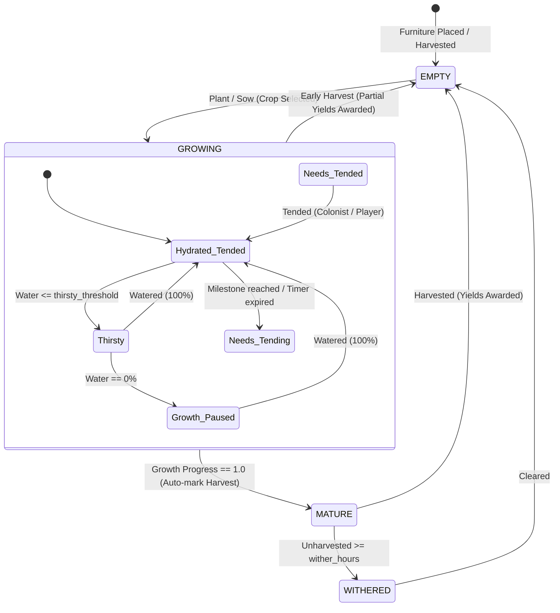
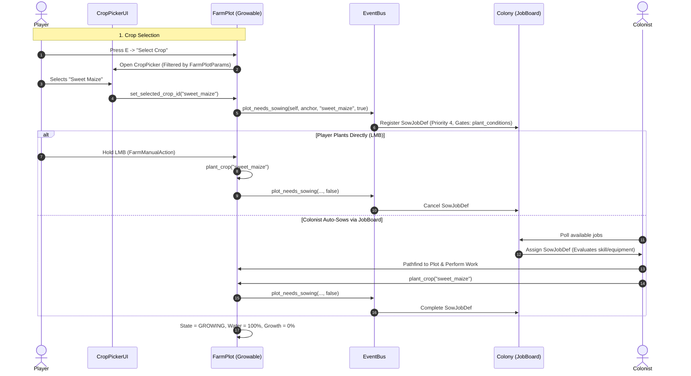
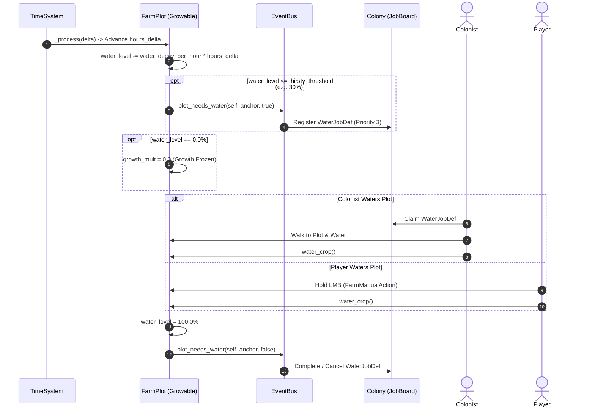
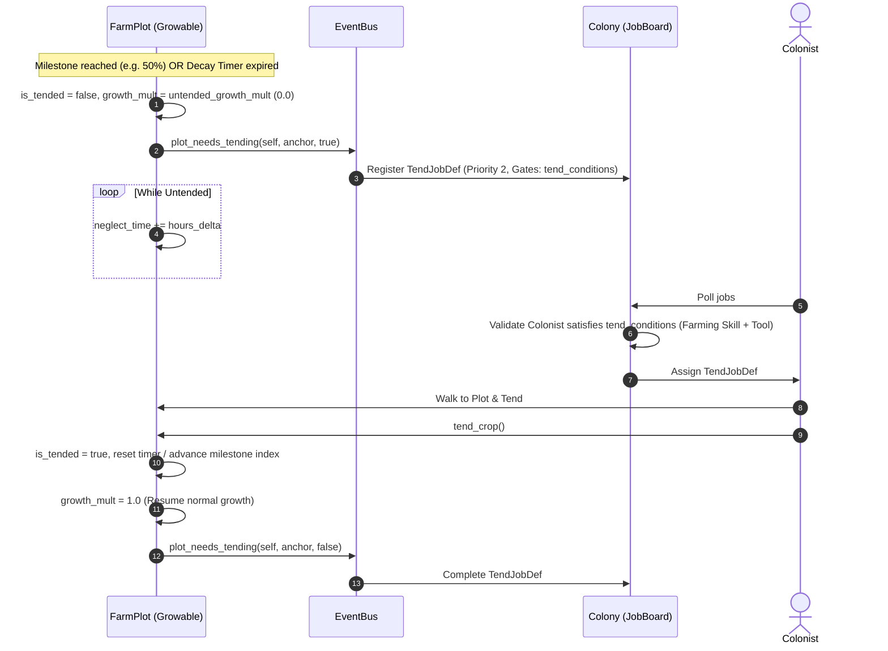
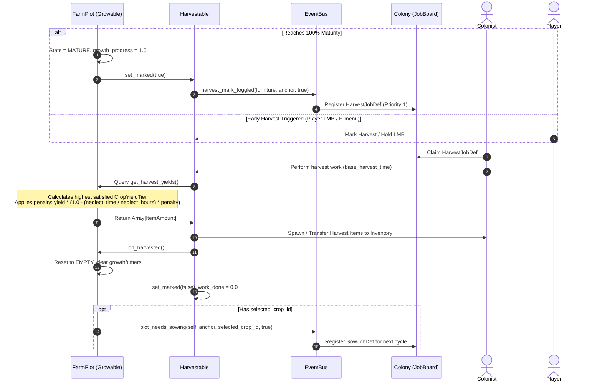

# Subsystem: Farming

The **Farming** subsystem governs the full crop life-cycle: farm plot furniture placement, seed selection, hydration decay and watering, milestone & decay tending, early harvesting via progressive yield tiers, automated job dispatch (`Sow`, `Water`, `Tend`, and `Harvest`), and context-sensitive player LMB interaction.

Authoring guide for creating new crops: `docs/HOWTO-author-crops.md`.

---

## Core Concepts

- **Farm Plots as Furniture**: Farm plots (e.g. `Growing Trough`) are authored as `FurnitureDef` resources carrying a `FarmPlotParams` sub-resource.
- **Component Pairing**: Placed farm plots attach both `Growable` and `Harvestable` components. `Growable` manages time-based simulation (hydration, tending, growth stages), while `Harvestable` provides unified interaction with the colony's `JobBoard` and player harvesting.
- **Dynamic Yields & Early Harvesting**: Crops define `CropYieldTier`s. When harvested (early by player command or automatically at 100% maturity), yields are scaled based on achieved milestones and any neglect penalties.
- **Context-Sensitive LMB Interaction**: Pointing at a farm plot and holding LMB automatically resolves the required action (`Plant` -> `Tend` -> `Water` -> `Harvest`).
- **Two-Tier Hydration Progression**:
  - **Tier 1 (Manual Hydration - Current):** Colonists and player manually fetch water to top off crop hydration.
  - **Tier 2 (Automated Irrigation - Future):** Voxel fluid hydration, trenches, and piped sprinkler networks automate watering.

---

## Architecture & Layout

| File | Type | Purpose |
|---|---|---|
| `data/crops/crop_def.gd` | Script | Schema for `CropDef` resources (growth parameters, hydration, tending modes, gating). |
| `data/crops/crop_yield_tier.gd` | Script | Schema for `CropYieldTier` milestone yields. |
| `data/crops/*.tres` | Data | Crop definitions (`cave_spud`, `holdout_wheat`, `bio_gel_orchid`). |
| `data/capability_params/farm_plot_params.gd` | Script | Sub-resource on `FurnitureDef` defining allowed crops for the plot. |
| `data/labors/farming.tres` | Data | Farming labor definition (`id = "farming"`). |
| `data/jobs/farming_job_def.gd` | Script (Resource) | Shared skeleton for the three plot labors: one WORK leg against the plot's `Growable`, skill-scaled `begin` over `work_time` (authored per `.tres`). Subclasses override `_needs(growable)` / `_apply(growable, actor)` — a future FertilizeJobDef drops in the same way. |
| `data/jobs/sow_job_def.gd` / `sow.tres` | Script/Data | Sowing job for empty farm plots (`_needs`: EMPTY + crop selected; `_apply`: `plant`). Also gates on the crop's `plant_conditions`. |
| `data/jobs/water_job_def.gd` / `water.tres` | Script/Data | Watering job for thirsty crops (`_needs`: `needs_water()`; `_apply`: `water`). |
| `data/jobs/tend_job_def.gd` / `tend.tres` | Script/Data | Tending job for crops needing maintenance (`_needs`: `needs_tending()`; `_apply`: `tend`). Also gates on the crop's `tend_conditions`. |
| `subsystems/farming/crop_library.gd` | Script | Static catalog loader for all crop definitions in `res://data/crops/`. |
| `subsystems/farming/growable.gd` | Script | Node component managing growth simulation, hydration, tending, and visuals. |
| `subsystems/harvesting/harvestable.gd` | Script | Extended to query `Growable` dynamic yields and reset plots on harvest. |
| `data/actions/farm_manual_action.gd` | Script | Context-sensitive player LMB action. |
| `data/actions/inspect_crop_action.gd` | Script | Opens crop inspection UI panel via E menu. |
| `data/actions/select_crop_action.gd` | Script | Opens crop picker dialog via E menu. |
| `ui/crop_inspect/` | UI | Crop inspection modal (`crop_inspect.tscn` + `.gd`). |
| `ui/crop_picker/` | UI | Crop selection modal (`crop_picker.tscn` + `.gd`). |

---

## EventBus Signals

| Signal | Emitted by | Listeners | Purpose |
|---|---|---|---|
| `plot_needs_sowing(growable, anchor, crop_id, needed)` | `Growable` | Colony (`JobBoard`) | Spawns or removes `SowJobDef` on `JobBoard`. |
| `plot_needs_water(growable, anchor, needed)` | `Growable` | Colony (`JobBoard`) | Spawns or removes `WaterJobDef` on `JobBoard`. |
| `plot_needs_tending(growable, anchor, needed)` | `Growable` | Colony (`JobBoard`) | Spawns or removes `TendJobDef` on `JobBoard`. |
| `harvest_mark_toggled(furniture, anchor, marked)` | `Harvestable` | Colony (`JobBoard`) | Spawns or removes `HarvestJobDef` on `JobBoard`. |

---

## Crop Lifecycle & State Machine

---

## End-to-End Flow Traces

### 1. Sowing Flow (Player Manual vs. Colonist JobBoard)

---

### 2. Hydration & Watering Flow

---

### 3. Tending & Neglect Flow (Gated Maintenance)

---

### 4. Harvesting & Dynamic Yield Evaluation Flow

---

## Player UI & Interaction

1. **Context-Sensitive LMB (`FarmManualAction`):**
   - Raycast detects `Growable` via `InteractionComponent`.
   - Single continuous LMB hold evaluates state in priority order:
     - `EMPTY` $	o$ Plants `selected_crop_id`.
     - `Needs Tending` $	o$ Performs tending action.
     - `Thirsty / Dry` $	o$ Waters plot to 100%.
     - `MATURE / Harvestable` $	o$ Completes harvest work.
2. **Context Menu (E Key):**
   - **Inspect Crop (`InspectCropAction`):** Opens `ui/crop_inspect/crop_inspect.tscn`, displaying current growth %, water level %, tending countdown, neglect time, and projected harvest yields.
   - **Select Crop (`SelectCropAction`):** Opens `ui/crop_picker/crop_picker.tscn` displaying a grid of available crops from `CropLibrary` (filtered by `FarmPlotParams.allowed_crops`).
