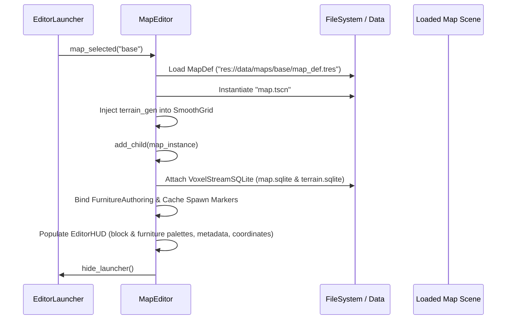

# Map Editor Architecture

The **Map Editor** (`tools/map_editor/map_editor.tscn` + `map_editor.gd`) is a standalone in-engine authoring environment for creating and editing dual-voxel maps in *Xeno Frontier: Colony Defense*.

---

## 1. Motivation: Why a Standalone Scene?

In *Xeno Frontier: Colony Defense*, environments consist of two complementary voxel systems:
1. **Blocky Voxels (`BlockyGrid`)**: Discrete cubic blocks for building, structural walls, floors, and furniture anchors.
2. **Smooth Terrain (`SmoothGrid`)**: Continuous Transvoxel signed-distance field (SDF) natural terrain (hills, valleys, cliffs).

In the Godot editor viewport, `VoxelTerrain` Transvoxel meshing cannot generate smooth meshes without an active runtime loop and `VoxelViewer`. Attempting to author maps inside the editor viewport left smooth terrain invisible.

The standalone Map Editor runs as a game scene (`F6` or configured main scene), providing:
- **Full Transvoxel runtime streaming**: Both blocky structures and natural terrain are visible and interactable simultaneously.
- **Unified authoring**: Voxel sculpting, block placement, furniture authoring, spawn markers, and metadata editing in one coherent tool.
- **Zero test-run impedance**: Maps authored in the editor immediately match runtime gameplay appearance and collisions.

---

## 2. Architecture & Scene Hierarchy

```
MapEditor (Node3D, tools/map_editor/map_editor.gd)
├── WorldEnvironment
├── DirectionalLight3D
├── EditorCamera (Camera3D)
│   └── VoxelViewer
├── GhostMesh (MeshInstance3D)
├── StructureTool (Node, tools/map_editor/structure_tool.gd)
│   └── StructureGhostMesh (MeshInstance3D, from GhostPreviewBuilder)
├── GridOverlay (MeshInstance3D, from EditorGridOverlay)
├── EditorHUD (CanvasLayer, tools/map_editor/editor_hud.gd)
│   └── HUDContainer (Control)
│       ├── BlockPalettePanel (Searchable ItemList via EditorPalettePanel)
│       ├── TerrainInfoPanel
│       ├── FurnitureInfoPanel (Searchable ItemList via EditorPalettePanel)
│       ├── StructureBrowser (tools/map_editor/structure_browser.gd)
│       ├── SpawnInfoPanel
│       ├── ModeBadge
│       ├── MapInfoPanel
│       ├── MetadataPanel
│       ├── TerrainDrawer
│       ├── HotkeyPanel
│       └── Crosshair + CoordLabel
├── EditorLauncher (CanvasLayer, tools/map_editor/editor_launcher.gd)
├── ExitConfirmationDialog (ConfirmationDialog)
└── [Loaded Map Root] (Map, res://data/maps/<id>/map.tscn)
    ├── BlockyGrid (BlockyGrid)
    │   └── VoxelTerrain
    ├── SmoothGrid (SmoothGrid)
    │   └── VoxelTerrain
    └── SpawnPoints (Node3D)
        ├── PlayerSpawn (Marker3D)
        ├── ColonistSpawn_* (Marker3D)
        ├── EnemySpawn_* (Marker3D)
        └── Furniture_* (Marker3D)
```

---

## 3. Map Lifecycle & Flows

### A. Creation & Loading Flow



**New maps** go through the launcher's create form, which emits `new_map_requested(payload: Dictionary)` — `map_id`, `map_type`, `terrain_mode` (`EditorLauncher.TerrainMode`: `NOISE`/`HEIGHTMAP`/`NONE`), `noise_def_path`, `image`, `height_start`, `height_range`, `snap_to_grid`. New maps take their baseline noise def and flora palette defaults from `res://data/map_editor/map_editor_config.tres` (`MapEditorConfig`), eliminating hardcoded content IDs from the editor script. Map identifiers must be snake_case (lowercase letters, digits, underscores, starting with a letter), enforced by `MapIdRules.validate(map_id)`. The identifier defines the folder name under `data/maps/<id>/`, preventing path traversal or special characters. The payload is a Dictionary (not a class) so a future blocky-image authoring key extends it without another signature change.

**Terrain generation on open** — the two "Inject terrain_gen" / "Attach streams" diagram steps are the terrain workflow, in this order:

1. `load_map` instantiates the map scene, then `_inject_terrain_gen` sets `SmoothGrid.terrain_gen` from `MapDef` **and** injects the material catalog (`set_material_catalog(BuildLibrary.get_terrain_materials())`) BEFORE `add_child` — so `_ready` builds the generator (heightmap image or noise, F13 branch rules), the Transvoxel mesher, and collision layer 3 from the def. A null def frees the SmoothGrid (blocky-only map). Full pipeline: [Voxel World](voxel-world.md) "Terrain generation when a map opens".
2. `_attach_streams` force-points both `VoxelStreamSQLite` paths at the **authored** `res://data/maps/<id>/` dbs (injecting streams when the scene ships none) — unlike runtime's copy-on-load to `user://`, the editor writes authored content directly. Saved blocks override the generator, so existing sculpts replay on open; sculpting/undo flows below flush after each edit.
3. The Terrain drawer's **Apply & Reload** re-runs this whole sequence with the edited def (`_reload_current_map` → flush → `load_map`) — the reload is deliberate; see §A3.

### A4. Flora Regeneration Parameters

New maps begin with no pre-generated trees. Instead, dynamic vegetation growth is configured through `MapDef` parameters in the launcher and Metadata panel:
- **Rate (Spawns / Day):** Number of trees/plants to attempt spawning throughout each in-game day (0 = disabled). Spawns are spaced evenly across the daytime cycle by `PlantSpawner`.
- **Cap:** Maximum concurrent alive flora allowed on the map (tagged with `"live_flora"` or defined in `flora_palette`).
- **Attempts:** Maximum random ground coordinate search attempts per spawn cycle before skipping.
- **Authoring Model:** Configured via `EditorLauncher` on map creation and editable anytime in-session via the **Metadata** panel (`_hud.set_metadata()`).

### A2. Terrain Setup: Heightmap or Noise

The create form's Terrain section picks how the new map's `SmoothGrid` generates (handled via `MapTerrainAuthoring`, see [Voxel World](voxel-world.md) for the generator side):

- **Procedural (noise)** — dropdown of shared `data/terrain/*.tres` defs (heightmap-driven defs are excluded; they are per-map content). This replaces the old hardcoded `default_ground.tres` wiring.
- **Heightmap (image)** — a native `FileDialog` (any disk location, png/jpg/bmp/webp/tga — the external-tool handoff) loads the image via `EditorLauncher.load_heightmap_image()`, which validates it (>= 16 px, warns past 1024^2) and normalizes to L8 grayscale. Creation writes a **per-map** `data/maps/<id>/terrain_gen.tres` whose `heightmap` is an **embedded `ImageTexture`**: the editor is a runtime process and cannot run Godot's import pipeline, so a bare PNG copied into the project wouldn't load via `ResourceLoader` — embedding keeps the map folder self-contained and export-safe.
- **None** — `terrain_gen = null`; the `SmoothGrid` frees itself on load (blocky-only map).

### A3. Terrain Drawer (in-session adjustment)

A toolbar toggle opens the `TerrainDrawer` (top-right; mutually exclusive with the Metadata panel; Esc closes it). It mirrors the metadata panel's `set_…`/`get_…edits()` pattern:

- Shows mode, def id, and for heightmap maps a read-only minimap with the axis contract (image +x -> world +x, image +y -> world +z, 1 px = 1 m).
- Edits `height_start`/`height_range` and `snap_to_grid` (heightmap maps) or seed/frequency (noise maps); **Replace Image…/Convert to Heightmap…/Add Heightmap…** picks a new image (pending until Apply); **Remove Terrain** strips `terrain_gen`.
- **Edit Contract & Value Retention:** The drawer sends only touched fields in `get_terrain_drawer_edits()`, preventing unedited controls from writing back clamped or rounded values to a def. The vertical span always mirrors the loaded `TerrainGenDef` (`height_start` and `height_range`) so height conversions inherit the map's active height band. Snapping (`snap_to_grid`) is an explicit opt-in action that re-quantizes the stored heightmap image into 1 m tiers upon Apply.
- **Ownership rule:** The editor never modifies shared baseline defs in `data/terrain/`. On first edit, a shared def is copied into `data/maps/<id>/terrain_gen.tres` ("map-owned"); shared files are never written to.
- **Apply & Reload:** Writes the map-owned def(s) and reloads the map exactly once (`_reload_current_map` -> flush -> `load_map`). Deliberately not a live generator hot-swap — already-streamed blocks keep stale generated data under a swap, while the single reload path (flush streams, re-attach, re-inject def) is known-consistent and cheap in the editor. Streams flush first so pending sculpts survive the reload. **Remove Terrain** clears the injected def, setting `SmoothGrid.terrain_gen = null` so removing terrain sticks across reloads. Standing warning in the drawer: sculpted edits keep their absolute heights, so changing the base may float or bury them (sqlite overrides are absolute, F2/F8).


### A5. Spawn Point Placement & Actor Authoring

Mode F5 (`Mode.SPAWN`) provides an interactive selector sidebar for configuring map entry points:
- **Spawn Type Selector**: Switch between `Player Spawn`, `Colonist Spawn`, `Enemy Spawn`, and `Remove Spawn` via the UI list, number keys `1..4`, or `Tab` cycling.
- **Actor Markers**:
  - **Player**: Single `PlayerSpawn` marker (Green capsule visualizer); synced to `MapDef.player_spawn`.
  - **Colonist**: Multi-marker `ColonistSpawn_N` (Blue capsule visualizer).
  - **Enemy**: Multi-marker `EnemySpawn_N` (Red capsule visualizer); synced to `MapDef.enemy_spawns`.
  - **Removal**: Selecting Remove or holding `Shift+LMB` deletes the nearest spawn marker within range (classified via `SpawnMarkerRules.kind_of()`). Furniture markers (`Furniture_*`) sharing the `SpawnPoints` container are ignored and never removed.
- **Runtime Consumption**: `SpawnHelpers.read_spawns()` scans `SpawnPoints` markers to instantiate actors at authored world positions.

### A6. Water Authoring

The Map Editor provides water body authoring integrated with `WaterGenerator` and the procedural terrain pipeline:
- **Creation Configuration**: `EditorLauncher` provides a `Water Body` enable toggle and `Water Level (Y)` spinbox when generating new maps, written to `MapDef.water_enabled` and `MapDef.water_level`.
- **In-Session Tuning**: `TerrainDrawer` exposes the water `Enabled` checkbox, `Y (m)` height spinbox, and an **"Apply Water"** action button.
- **Mechanism (`apply_water_settings`)**: Applies the water toggle and level to `MapDef` and its map-owned terrain definition, persists them to disk, and reloads the map. At load time, `BlockyGrid` installs `WaterGenerator` when water is enabled. `WaterGenerator` populates water in newly generated terrain columns between the terrain floor and `water_level`.
- **Generator vs Saved Blocks**: Blocks already committed to `map.sqlite` override procedural generation, so previously saved blocks retain their contents across reloads; water appears in blocks generated afterwards. There is currently no in-editor column sweep to replace blocks already saved to sqlite.
- **Planned Flood Sweep**: A full column-sweep water flooding tool that updates existing authored and saved blocks across `world_bounds` is planned (see `docs/TODO.md`).

### A7. Palettes & Content Discovery

- **Recursive Content Discovery (`EditorContentLoader`)**: Furniture and structure definitions are discovered recursively across `res://data/furniture/` (which groups items into category subfolders such as `storage/`, `defense/`, etc.) and `res://data/structures/` (both `.tres` and `.res` definitions). Resources are strictly filtered by type (`FurnitureDef` vs. co-located `WildFloraDef`) and stably sorted by ID or display name.
- **Shared Stepping and Filtering (`EditorPalettePanel`)**: `EditorPalettePanel.step_index()` provides cyclic index wrapping with fallback to the first element when current is not in the candidates list. Filtered row indices return copies to prevent external mutation. `EditorPalettePanel.query_matches()` provides a unified case-insensitive search predicate across name, ID, and optional category text for both `EditorPalettePanel` and `StructureBrowser`.

### B. Dual-Voxel Editing & Undo Pipeline

Every modification records its reverse operation in a bounded undo buffer (`_undo_stack: Array[Dictionary]`, max depth 50):

- **Blocky Edits (`_do_block_paint` / `_do_block_erase`)**:
  1. Computes the brush bounding box (`_brush_box`).
  2. Reads existing voxel IDs for all cells in the box (`_block_vt.get_voxel(pos)`).
  3. Pushes `{ "type": "block", "ops": [{ "pos": Vector3i, "old_value": int }, ...] }` to `_undo_stack`.
  4. Writes new voxel IDs via `_block_vt.do_box()` and flushes changes to `map.sqlite`.
  5. Reversing: Restores exact prior voxel IDs and saves block terrain.

- **Smooth Terrain Edits (`_do_terrain_add` / `_do_terrain_carve`)**:
  1. Captures a snapshot of the SDF samples and block material metadata across the sphere brush volume plus margin via `SmoothGrid.capture_cells()`.
  2. Pushes `{ "type": "terrain", "snapshot": Dictionary }` to `_undo_stack`.
  3. Executes `SmoothGrid.add_material()` or `SmoothGrid.carve()` and flushes changes to `terrain.sqlite`.
  4. Reversing: Restores the snapshot directly via `SmoothGrid.restore_snapshot()` (writing only samples and sidecar metadata that differ), avoiding the craters or bulges produced by naive inverse booleans.

  `M` / `Shift+M` cycles the added material (`_cycle_terrain_material` — the Terrain-mode mirror of the block palette) through `BuildLibrary.get_terrain_materials()`; the HUD reads it back via `set_terrain_info` as `name (i/N)`. Sculpted blobs carry the id PERSISTENTLY in the F12 sidecar (a per-block metadata dict riding `terrain.sqlite`) — the dig action later resolves hp/yields per position from it. Visually each blob gets a colored Decal marker from the material's `color` (surface-material blobs excepted — they match the terrain's top band), and the terrain itself carries the depth-banded shader look; per-voxel painting is a documented dead end (F14 — see [Mining](mining.md) §Visuals).

- **Structure Stamps (`_do_structure_stamp`)**:
  1. Computes placement origin with Y-offset, quarter-turn Y rotation, and horizontal nudge offset.
  2. Previews the 3D volume via `GhostPreviewBuilder` (optimized `ArrayMesh` with vertex colors and internal face culling).
  3. Queries terrain-touching world cells (`StructureTool.terrain_voxel_positions()`) and captures a pre-stamp smooth terrain snapshot via `SmoothGrid.capture_cells()`.
  4. Stamps `BLOCK`, `SMOOTH_TERRAIN`, and `AIR` operations via `StructureStamper` through `VoxelGridAdapter`.
  5. Pushes `{ "type": "structure", "ops": Array[Dictionary], "terrain_snapshot": Dictionary }` to `_undo_stack`.
  6. Reversing: Restores previous block IDs and air cells in reverse sequence and restores the terrain snapshot via `SmoothGrid.restore_snapshot()`.

### C. Save Flow

When `save_map() -> bool` is triggered (`Ctrl+S` or UI Save button):
1. **Flush Voxel Streams**: Calls `Map.flush_voxel_streams()` to persist uncommitted voxel blocks to SQLite first, ensuring the scene never outruns its terrain.
2. **Sync Spawns**: Syncs `PlayerSpawn` and `EnemySpawn_*` marker positions into `MapDef`.
3. **Apply Metadata Edits**: Reads only fields modified in the HUD metadata panel (`get_metadata_edits()`), preventing untouched off-grid values from being rewritten by spinner rounding.
4. **Persist Def & Scene**: Saves `MapDef` to `map_def.tres` and packs/persists `map.tscn`. The injected terrain def is stripped while packing (`SmoothGrid.terrain_gen = null`) and restored immediately after, ensuring that runtime `SceneManager` only injects terrain when `MapDef.terrain_gen` is non-null and older scenes do not resurrect deleted terrain.
5. **Report Status**: Returns `true` only when both file writes succeed. If either fails, `_dirty` remains `true` and the dirty indicator stays visible in the HUD.

### D. Reload Flows & Cursor State

Actions that reload the map from disk (such as the Terrain Drawer **Apply** action or Water flood reload) guard against discarding unsaved work via `_guard_unsaved(action)`:
- If `_dirty` is `true`, a confirmation modal prompts the author to "Save and Continue", "Discard and Continue", or "Cancel".
- If a save fails during "Save and Continue", the reload sequence aborts to protect author work.
- Reloads triggered from editor panels (`load_map(id, false)`) preserve `Input.mouse_mode = Input.MOUSE_MODE_VISIBLE`, keeping the cursor free rather than recapturing mouse look.

---

## 4. Relationship to `voxel_paint` Plugin

The `voxel_paint` Godot editor plugin (`addons/voxel_paint/`) authored blocky voxels inside the Godot editor. With the Map Editor:
- The Map Editor completely replaces the plugin by offering full dual-voxel editing, smooth terrain visibility, furniture placement, spawn point management, and in-game coordinate verification.
- Shared logic (e.g. `FurnitureAuthoring` and `BlockLibrary`) is reused directly.
