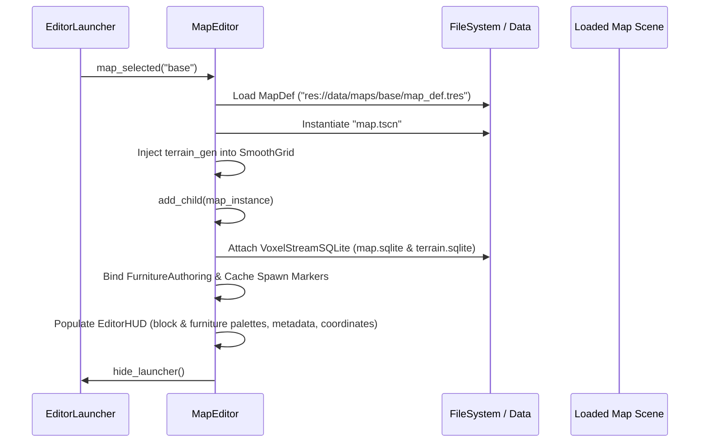

# Map Editor Architecture

The **Map Editor** (`tools/map_editor/map_editor.tscn` + `map_editor.gd`) is a standalone in-engine authoring environment for creating and editing dual-voxel maps in *Vek: Holdout*.

---

## 1. Motivation: Why a Standalone Scene?

In *Vek: Holdout*, environments consist of two complementary voxel systems:
1. **Blocky Voxels (`BlockyGrid`)**: Discrete cubic blocks for building, structural walls, floors, and furniture anchors.
2. **Smooth Terrain (`SmoothGrid`)**: Continuous Transvoxel signed-distance field (SDF) natural terrain (hills, valleys, cliffs).

In the Godot editor viewport, `VoxelTerrain` Transvoxel meshing cannot generate smooth meshes without an active runtime loop and `VoxelViewer`. Attempting to author maps inside the editor viewport left smooth terrain invisible.

The standalone Map Editor runs as a game scene (`F6` or configured main scene), providing:
- **Full Transvoxel runtime streaming**: Both blocky structures and natural terrain are visible and interactable simultaneously.
- **Unified authoring**: Voxel sculpting, block placement, furniture authoring, spawn markers, and metadata editing in one coherent tool.
- **Zero test-run impedance**: Maps authored in the editor immediately match runtime gameplay appearance and collisions.

---

## 2. Architecture & Scene Hierarchy

```
MapEditor (Node3D, tools/map_editor/map_editor.gd)
├── WorldEnvironment
├── DirectionalLight3D
├── EditorCamera (Camera3D)
│   └── VoxelViewer
├── GhostMesh (MeshInstance3D)
├── StructureTool (Node, tools/map_editor/structure_tool.gd)
│   └── StructureGhostMesh (MeshInstance3D, from GhostPreviewBuilder)
├── GridOverlay (MeshInstance3D, from EditorGridOverlay)
├── EditorHUD (CanvasLayer, tools/map_editor/editor_hud.gd)
│   └── HUDContainer (Control)
│       ├── BlockPalettePanel (Searchable ItemList via EditorPalettePanel)
│       ├── TerrainInfoPanel
│       ├── FurnitureInfoPanel (Searchable ItemList via EditorPalettePanel)
│       ├── StructureBrowser (tools/map_editor/structure_browser.gd)
│       ├── SpawnInfoPanel
│       ├── ModeBadge
│       ├── MapInfoPanel
│       ├── MetadataPanel
│       ├── TerrainDrawer
│       ├── HotkeyPanel
│       └── Crosshair + CoordLabel
├── EditorLauncher (CanvasLayer, tools/map_editor/editor_launcher.gd)
├── ExitConfirmationDialog (ConfirmationDialog)
└── [Loaded Map Root] (Map, res://data/maps/<id>/map.tscn)
    ├── BlockyGrid (BlockyGrid)
    │   └── VoxelTerrain
    ├── SmoothGrid (SmoothGrid)
    │   └── VoxelTerrain
    └── SpawnPoints (Node3D)
        ├── PlayerSpawn (Marker3D)
        ├── ColonistSpawn_* (Marker3D)
        └── Furniture_* (Marker3D)
```

---

## 3. Map Lifecycle & Flows

### A. Creation & Loading Flow



**New maps** go through the launcher's create form, which emits `new_map_requested(payload: Dictionary)` — `map_id`, `map_type`, `terrain_mode` (`EditorLauncher.TerrainMode`: `NOISE`/`HEIGHTMAP`/`NONE`), `noise_def_path`, `image`, `height_start`, `height_range`. The payload is a Dictionary (not a class) so a future blocky-image authoring key extends it without another signature change.

### A2. Terrain Setup: Heightmap or Noise

The create form's Terrain section picks how the new map's `SmoothGrid` generates (see [Voxel World](voxel-world.md) for the generator side):

- **Procedural (noise)** — dropdown of shared `data/terrain/*.tres` defs (heightmap-driven defs are excluded; they are per-map content). This replaces the old hardcoded `default_ground.tres` wiring.
- **Heightmap (image)** — a native `FileDialog` (any disk location, png/jpg/bmp/webp/tga — the external-tool handoff) loads the image via `EditorLauncher.load_heightmap_image()`, which validates it (≥ 16 px, warns past 1024²) and normalizes to L8 grayscale. Creation writes a **per-map** `data/maps/<id>/terrain_gen.tres` whose `heightmap` is an **embedded `ImageTexture`**: the editor is a runtime process and cannot run Godot's import pipeline, so a bare PNG copied into the project wouldn't load via `ResourceLoader` — embedding keeps the map folder self-contained and export-safe.
- **None** — `terrain_gen = null`; the `SmoothGrid` frees itself on load (blocky-only map).

### A3. Terrain Drawer (in-session adjustment)

A toolbar toggle opens the `TerrainDrawer` (top-right; mutually exclusive with the Metadata panel; Esc closes it). It mirrors the metadata panel's `set_…`/`get_…edits()` pattern:

- Shows mode, def id, and for heightmap maps a read-only minimap with the axis contract (image +x → world +x, image +y → world +z, 1 px = 1 m).
- Edits `height_start`/`height_range` (heightmap maps) or seed/frequency (noise maps); **Replace Image…/Convert to Heightmap…/Add Heightmap…** picks a new image (pending until Apply); **Remove Terrain** strips `terrain_gen`.
- **Apply = write def(s) + reload the map.** Deliberately not a live generator hot-swap — already-streamed blocks keep stale generated data under a swap, while the reload path (flush streams, re-attach, re-inject def) is known-consistent and cheap in the editor. Streams flush first so pending sculpts survive the reload. Standing warning in the drawer: sculpted edits keep their absolute heights, so changing the base may float or bury them (sqlite overrides are absolute, F2/F8).

### B. Dual-Voxel Editing & Undo Pipeline

Every modification records its reverse operation in a bounded undo buffer (`_undo_stack: Array[Dictionary]`, max depth 50):

- **Blocky Edits (`_do_block_paint` / `_do_block_erase`)**:
  1. Computes the brush bounding box (`_brush_box`).
  2. Reads existing voxel IDs for all cells in the box (`_block_vt.get_voxel(pos)`).
  3. Pushes `{ "type": "block", "ops": [{ "pos": Vector3i, "old_value": int }, ...] }` to `_undo_stack`.
  4. Writes new voxel IDs via `_block_vt.do_box()` and flushes changes to `map.sqlite`.
  5. Reversing: Restores exact prior voxel IDs and saves block terrain.

- **Smooth Terrain Edits (`_do_terrain_add` / `_do_terrain_carve`)**:
  1. Records the sculpt hit point and radius.
  2. Pushes `{ "type": "terrain", "point": Vector3, "radius": float, "was_add": bool }` to `_undo_stack`.
  3. Executes `SmoothGrid.add_material()` or `SmoothGrid.carve()` and flushes changes to `terrain.sqlite`.
  4. Reversing: Inverts the operation (adds if previously carved, carves if previously added).

  `M` / `Shift+M` cycles the added material (`_cycle_terrain_material` — the Terrain-mode mirror of the block palette) through `BuildLibrary.get_terrain_materials()`; the HUD reads it back via `set_terrain_info` as `name (i/N)`. The id rides the `material_placed` signal only (F8: no per-voxel material channel), so it is dig hardness/yields authoring metadata, not a visual change.

- **Structure Stamps (`_do_structure_stamp`)**:
  1. Computes placement origin with Y-offset, quarter-turn Y rotation, and horizontal nudge offset.
  2. Previews the 3D volume via `GhostPreviewBuilder` (optimized `ArrayMesh` with vertex colors and internal face culling).
  3. Stamps `BLOCK`, `SMOOTH_TERRAIN`, and `AIR` operations via `StructureStamper` through `VoxelGridAdapter`.
  4. Pushes `{ "type": "structure", "ops": Array[Dictionary] }` containing the recorded changes to `_undo_stack`.
  5. Reversing: Restores previous block IDs / raw values and carves/restores terrain modifications in reverse order.

### C. Save Flow

When `save_map()` is triggered (`Ctrl+S` or UI Save button):
1. **Flush Voxel Streams**: Calls `Map.flush_voxel_streams()` to persist uncommitted voxel blocks to SQLite.
2. **Update MapDef**: Reads metadata edits (`display_name`, `description`, `map_type`, `difficulty`) and `PlayerSpawn` position, then saves `map_def.tres` via `ResourceSaver`.
3. **Pack Scene**: Packs `_map_root` (excluding editor camera and UI scaffolding) into `PackedScene` and saves `map.tscn`.
4. **Update HUD**: Clears the dirty indicator flag.

---

## 4. Relationship to `voxel_paint` Plugin

The `voxel_paint` Godot editor plugin (`addons/voxel_paint/`) authored blocky voxels inside the Godot editor. With the Map Editor:
- The Map Editor completely replaces the plugin by offering full dual-voxel editing, smooth terrain visibility, furniture placement, spawn point management, and in-game coordinate verification.
- Shared logic (e.g. `FurnitureAuthoring` and `BlockLibrary`) is reused directly.
