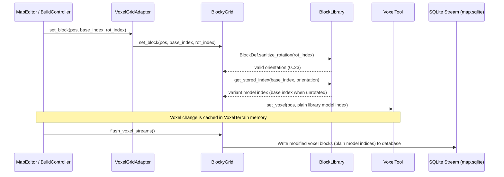
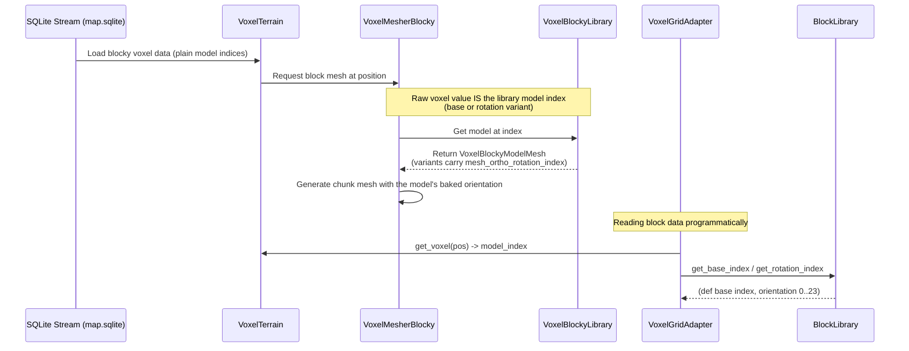

# Subsystem: Voxel / World

The voxel world: blocky structures + smooth natural terrain (the dual-voxel conversion, `docs/TODO.md`). Wraps Zylann's `voxel_tool` plugin. All voxel coupling lives here — other subsystems (Build) interact via the `IBlockGrid` interface, never `voxel_tool` directly.

> **Voxel-tool gotchas & verified facts** (editor hit-detection, the 40-frame settle, library/stream behavior, the smooth-edit spike F8) live in `docs/VOXEL-TOOL-NOTES.md`.
> **Block authoring guide** (Blender 3D mesh scale, origin alignment, 3-axis rotation, shaders, and Map Editor verification) lives in `docs/HOWTO-author-blocks.md`.

## Collision layers

The dual-voxel layer plan (locked decisions in `docs/TODO.md`): blocky structures and smooth natural terrain each own a layer, so physics queries can address one ground without the other. Both grids assign their terrain's layer + mask in `_ready` code — map templates don't carry them, so already-stamped POIs get them at runtime.

| Layer | Name | Who lives there |
|---|---|---|
| 1 | World | Furniture trimesh statics |
| 2 | TerrainBlocky | The blocky `VoxelTerrain` (`BlockyGrid`) |
| 3 | TerrainSmooth | The smooth `VoxelTerrain` (`SmoothGrid`) |
| 4 | Player | Player capsule |
| 5 | Build | Furniture/blueprint `BuildBody` interaction boxes |
| 6 | Colonist | Colonist capsules |

Masks that follow from it: player + colonist bodies and the camera spring arm mask `1|2|4` (statics + both terrains — never Build boxes or other capsules); the build/deconstruct ray masks `1|2|4|16` (statics + both terrains + Build boxes — see `BlockyGrid.BUILD_RAY_MASK`); terrain bodies mask `8|32` (the bodies that stand on terrain). F7 (VOXEL-TOOL-NOTES): a terrain's layer and mask must move together — assigning only `collision_layer` silently stops body interaction while rays keep hitting.

## Files

| File | Type | Responsibility |
|---|---|---|
| `map.tscn` / `map.gd` | Scene/Script | The MapRoot — the current game world (`Map`, structural container only — no gameplay logic). Swapped by SceneManager on base↔POI transitions. Holds BlockyGrid (structures-only — the template bakes no blocky generator) + optional SmoothGrid (the initial terrain; new maps default `terrain_gen` to the 50 m deep `data/terrain/default_ground.tres`) + containers for player/colonists/enemies/furniture. Authored POIs have per-map scenes at `data/maps/<id>/map.tscn` (see [Maps](maps.md) subsystem); the pristine template lives at `subsystems/maps/map_template.tscn`. |
| `blocky_grid.gd` | Script | The structures half. Implements `IBlockGrid` (in `build/`); wraps `voxel_tool` get/set + the surface-tagged Godot-physics raycast (see `docs/VOXEL-TOOL-NOTES.md`). Owns block get/set, per-cell HP, the damage surface, and the blocky terrain's collision layer (2). Does NOT own placement UX (that's Build). |
| `smooth_grid.gd` | Script | The natural-terrain half — BlockyGrid's mirror, different mesher/generator. `carve` (sphere) / `carve_box` (hard per-sample box, F15) / `add_material` edit primitives (F8 semantics; `add_material` is the ONLY smooth-add path and writes the F12 material sidecar), per-position material identity via `get_material_at`/`get_material_def_at` (sidecar → `TerrainStrata` depth rules → `default_material`), cached `height_at` with D4 invalidation, `raycast_to_surface` masked to TerrainSmooth. Opt-in: a `MapDef` without `terrain_gen` makes the node free itself at `_ready` (SceneManager injects the def pre-tree). |
| `terrain_strata.gd` | Script (RefCounted) | Deterministic natural-material selection for GENERATED ground (terrain_mining/plan.md): depth band from the pristine surface (F13) + per-material coherent noise in a softmax with `spawn_weight`. No storage — same position + seed answers the same material forever, which keeps the sidecar edits-only. Catalog injected via `SmoothGrid.set_material_catalog` (SceneManager / map editor), never read directly. |
| `block_library.gd` | Script (Resource) | Owns the `VoxelBlockyLibrary` the blocky mesher renders with; maps string block_id ↔ integer library index, and id → `BlockDef`. Enforces the index convention (0 = air, terrain = 1) and bakes the library from `data/blocks/`. |
| `voxel_block_encoder.gd` | Script | Static rotation-state math: the 24 orthogonal `Basis` states, index↔basis mapping, axis rotations. NOT a storage packing — stored voxel values are plain library model indices (see the storage note below). |
| `../data/blocks/` | Data | One `.tres` per block type (wood, scrap, stone, metal, reinforced, wood_stairs). See [Data Schemas](data-schemas.md). |
| `../data/terrain/` | Data | `TerrainGenDef` (generator params + walk slope gate; optional `heightmap: Texture2D` switches generation from noise to image — brightness maps across `height_start`..`height_start+height_range`, 1 px = 1 m, Lossless import required) and `materials/TerrainMaterialDef` (identity + mining stats: hp, depth band, vein size, spawn weight, dig yields — no visual refs, see F8/F11; identity resolves per-position via the F12 sidecar + strata). `data/mining/dig_tool.tres` carries the dig action's stats. See [Data Schemas](data-schemas.md). |

**Walkability seam (D4):** `MapWiring.hybrid_ground_probe` composes the smooth grid's `height_at` with direct SDF lattice checks (`SmoothGrid.is_solid_at` / `VoxelGridAdapter.is_terrain_at` — a cell counts as carved air only when all 8 of its corner samples read air, so `carve_box`'s one-plane bleed into neighbouring walls stays solid). A cell is standable when either the natural surface passes through it on a walkable slope ($\\le 45^\\circ$), plain blocky rules hold, or an **underground excavated tunnel/cavity** provides clear air space with solid floor below and $\\ge 2\\text{m}$ vertical head clearance. Buried unexcavated solid cells are cancelled. See [Pathfinding & Navigation](pathfinding.md) (design note 8), [Maps](maps.md) `wire_colonists`, and [Colonists](colonists.md) VoxelPathfinder.

## Signals

| Signal | Emitted by | Listeners | Via EventBus? | Flows |
|---|---|---|---|---|
| `block_placed(pos: Vector3i, block_id: String)` | `blocky_grid.gd` | Build (ghost validation), colonists (pathfinding re-bake) | No (same scene) | Place Blueprint |
| `block_destroyed(pos: Vector3i)` | `blocky_grid.gd` | colonists (pathfinding), raids (breach detection) | No | Enemy Attack Block |
| `material_placed(pos: Vector3, material_id: String)` | `smooth_grid.gd` | (none yet — `SmoothPlacementStrategy` calls `add_material` directly; the signal is the future sound/particles hook) | No | — |
| `material_carved(pos: Vector3)` | `smooth_grid.gd` | (none yet — DigAction calls `carve` directly; the signal is the future sound/particles hook) | No | — |

## Terrain generation when a map opens

The smooth terrain is **def-driven and assembled at load** — nothing terrain-shaped is baked into the scene except the node skeleton. Opening a map runs the same pipeline at runtime (`SceneManager.swap_map`) and in the editor (`map_editor.load_map`):

1. **Injection, pre-tree.** `MapDef.terrain_gen` (a `TerrainGenDef`) is injected into the `SmoothGrid` BEFORE it enters the tree, together with the material catalog (`set_material_catalog(BuildLibrary.get_terrain_materials())` — the strata's input). A null def leaves the node to free itself at `_ready`: "no smooth grid at all", so terrain-less maps play exactly as before. The editor's `_inject_terrain_gen` performs the same pair.
2. **Build, `SmoothGrid._ready`.** The def's heightmap (when present) is prepared ONCE into an L8 `Image` that feeds BOTH the generator and `_pristine_height` — the F13 lockstep rule (strata and generator must describe the same def); noise maps instead mirror the generator's `FastNoiseLite` sampler for the same purpose. `_build_generator` then picks the branch: `VoxelGeneratorImage` (image + `height_start`/`height_range` + half-size origin offset; repeats periodically, F10) or `VoxelGeneratorNoise2D` (noise + span; the surface is exactly `start + (n·0.5+0.5)·range`, F13). The `VoxelMesherTransvoxel`, collision layer 3 + body mask, and the D4 `block_loaded`/`block_unloaded` cache hooks are set here — plus the visuals: the terrain `ShaderMaterial` (depth-banded triplanar look from a 512² pristine-height bake) goes onto `material_override` (F11/F14; see [Mining](mining.md) "Visuals"). See the SmoothGrid class reference below.
3. **Streaming.** Each map's `VoxelStreamSQLite` is attached per map — **runtime** copies the authored db to `user://maps/<id>/terrain.sqlite` on first load and repoints the stream (`res://` is read-only; copy-on-load, see [Save / Load](save.md)), while the **editor** points straight at the authored `res://data/maps/<id>/terrain.sqlite` (writing authored content is the editor's job). Saved blocks **override the generator**: sculpted/edited cells replay on top of generated ground wherever a viewer streams them in (F2/F8).
4. **Identity live.** With the catalog injected, every solid position answers `get_material_at` — authored sidecar (F12) → strata depth rules (F13) → `default_material` — so mining, dig feedback, and editor previews all resolve per position. See [Mining](mining.md).

Editor regeneration follows the same pipeline by design: the Terrain drawer's **Apply & Reload** saves the edited def and reloads the map (never a live generator hot-swap — already-streamed blocks would keep stale generated data). Details in [Map Editor](map-editor.md) §3A.

## Flow Trace: Player targets ground (raycast)

**Trigger:** Build mode active; player moves cursor.

1. BuildController fires the Godot physics raycast from camera each frame (`BlockyGrid.raycast_to_voxel`, masked `1|2|4|16`).
2. The collider's collision layer tags the hit (`surface`: `"blocky"` / `"smooth"` / `"body"`). Blocky/body hits compute the struck cell via `floor(hit.position - hit.normal * 0.001)`; a smooth hit returns the **pre-derived placement cell** `floor(hit.position + normal * 0.5)` with a zero normal (slope normals aren't axis-aligned — F7) plus float `smooth_point`/`smooth_normal`.
3. BuildController derives the placement cell through `_placement_cell` (smooth = as-is; blocky/body = struck + face normal).
4. Ghost preview position + validity tint update.

**End state:** Ghost preview shows valid/invalid placement under cursor — on plate, blocks, or hillside alike.

## Class Reference

### Class: Map

**Extends:** Node3D
**Script:** `map.gd`
**Description:** The MapRoot — the current game world, swapped by SceneManager on base↔POI transitions. A structural container only; holds no gameplay logic. The voxel world's behavior lives in `BlockyGrid` / `SmoothGrid` / `BlockLibrary`. The base scene (`map.tscn`) and each authored POI (per-map `data/maps/<id>/map.tscn` stamped from `maps/map_template.tscn`) use this root script.
**Used by:** SceneManager (swaps the whole node), subsystems that fetch their containers/grids via the accessors.
**Lifecycle:** `@onready` resolves its child refs at `_ready`.

**Properties:**

| Property | Type | Description |
|---|---|---|
| `blocky_grid` | `BlockyGrid` | `@onready` ref to the `BlockyGrid` child (the `IBlockGrid` owner). |
| `smooth_grid` | `SmoothGrid` | `@onready` ref via `get_node_or_null` — **null on maps without natural terrain** (node absent, or freed itself for lack of `terrain_gen`). |
| `colonist_container` | `Node3D` | `@onready` ref; parent of active colonist instances. |
| `enemy_container` | `Node3D` | `@onready` ref; parent of active enemy instances. |
| `furniture_container` | `Node3D` | `@onready` ref; parent Node3D for free-standing furniture placed at runtime (Build subsystem). |

**Functions:**

| Function | Description |
|---|---|
| `get_blocky_grid() -> BlockyGrid` | Convenience proxy (most callers want the grid, not the world). |
| `get_smooth_grid() -> SmoothGrid` | The natural-terrain grid, or null — callers null-check; terrain-less maps are the default. |
| `get_blocky_terrain() -> VoxelTerrain` | Delegates to `blocky_grid.get_terrain()`. |
| `get_smooth_terrain() -> VoxelTerrain` | The smooth `VoxelTerrain`, or null when the map has none (node absent, or a SmoothGrid that freed itself on null `terrain_gen`). |
| `persisted_streams()` / `stream_dbs()` / `flush_voxel_streams()` | The two-stream persistence pairing (Phase 4): `{terrain, db}` pairs — blocky `map.sqlite` always, smooth `terrain.sqlite` when present. One source shared by SceneManager's copy-on-load redirect and SaveSystem's park flush / slot snapshot-restore, so the sites can't drift. `flush_voxel_streams` saves modified blocks on both grids (INV-3's voxel half). |
| `ground_height_at(x: float, z: float) -> float` | Combined spawn query (D4/Phase 3): one downward ray masked `TerrainBlocky\|TerrainSmooth` — the first hit from above is the highest surface (hill or plate), so player/colonist spawn markers snap onto real ground regardless of authored Y. Furniture statics and bodies never answer. `NAN` when neither terrain reaches the column. Per-grid `height_at` stays layer-specific — this is a placement query, not the walkability source. |
| `get_furniture_container() -> Node3D` | The furniture parent node. |
| `get_colonist_container() -> Node3D` | The colonist parent node (where persistent colonists reparent on map swaps). |

### Class: BlockyGrid

**Extends:** Node
**Script:** `blocky_grid.gd` (renamed from `voxel_grid.gd` in the dual-voxel conversion)
**Description:** Implements `IBlockGrid` (defined in `build/i_block_grid.gd`). The sole owner of voxel_tool access for structures. Block identity is a string `block_id` everywhere outside this class; internally the integer voxel-tool library index is stored and `BlockLibrary` does the id↔index translation. Tracks per-position HP (`_hp_by_pos`) so combat/raids can damage blocks below their `BlockDef.hp` before destroying them.
**Used by:** Build (placement + raycast), Colonists (A* pathfinding), Raids (breach + damage), Combat (`apply_damage`).
**Lifecycle:** `_ready()` assigns the terrain its collision layer + body mask (F7: they move together), constructs the `BlockLibrary`, wires its `VoxelBlockyLibrary` into the terrain mesher, and fetches the `VoxelTool` reference from the `VoxelTerrain` child.

**Properties:**

| Property | Type | Description |
|---|---|---|
| `terrain_path` | `NodePath` | `[export]` Path to the `VoxelTerrain` child; default `^"VoxelTerrain"`. |
| `_terrain` | `VoxelTerrain` | `@onready` ref; owns the physics world its collision bodies live in. |
| `_voxel_tool` | `VoxelTool` | Fetched in `_ready`; `mode = MODE_SET`. |
| `_library` | `BlockLibrary` | Constructed in `_ready`. |
| `_hp_by_pos` | `Dictionary` | `Vector3i -> int` (current HP; absent = air). |

**Constants:** `TERRAIN_LAYER = 2`, `TERRAIN_BODY_MASK = 8|32`, `SMOOTH_TERRAIN_LAYER_VALUE = 4`, `BUILD_RAY_MASK = 1|2|4|16`.

**Signals:**

| Signal | Description |
|---|---|
| `block_placed(pos: Vector3i, block_id: String)` | A block was placed. Listeners: Build (ghost), colonists (re-bake), Functional Rooms (when wired). |
| `block_destroyed(pos: Vector3i)` | A block's HP hit 0 or was removed. Listeners: colonists (re-bake), raids (breach), Functional Rooms (when wired). |

**Functions:**

| Function | Description |
|---|---|
| `get_block_at(pos: Vector3i) -> String` | Returns block ID at position; empty string if air. |
| `set_block_at(pos: Vector3i, block_id: String) -> void` | Places a block; seeds `_hp_by_pos[pos] = def.hp`; emits `block_placed`. |
| `remove_block_at(pos: Vector3i) -> void` | Removes a block; clears its HP entry; emits `block_destroyed`. |
| `raycast_to_voxel(origin, dir, max_dist, exclude: Array = []) -> Dictionary` | Godot physics raycast masked to `BUILD_RAY_MASK`. Returns `{position, normal, hit, surface}` — see the flow trace for the per-surface contract; smooth hits carry `smooth_point`/`smooth_normal` floats. `exclude` is an `Array[RID]` to skip (player body). NOT `VoxelTool.raycast` (see gotcha). |
| `height_at(x: float, z: float, normal_out: Array = []) -> float` | Height of the highest **blocky** surface at column (x, z) — downward ray masked to layer 2, so statics/bodies/smooth never answer. `NAN` on no ground; `normal_out` receives the surface normal on hit (slope gating). |
| `get_hp_at(pos: Vector3i) -> int` | Current HP of the block at pos, or 0 if air/terrain. |
| `has_block_at(pos: Vector3i) -> bool` | Whether a buildable block exists at pos (HP entry present). |
| `apply_damage(pos: Vector3i, amount: int) -> void` | Applies damage to a buildable block; destroys it (and emits `block_destroyed`) when HP hits 0. Terrain is ignored (no HP entry). |
| `get_library() -> BlockLibrary` | The block library (id↔index + def lookup). |
| `get_terrain() -> VoxelTerrain` / `get_voxel_tool() -> VoxelTool` | Accessors for consumers that need the raw handles. |
| `serialize() -> Dictionary` / `deserialize(data)` | SaveSystem contract — buildable-block HP only; block types persist via the sqlite stream. |
| `get_raw_voxel(pos: Vector3i) -> int` | Returns the raw stored voxel integer at position — a `VoxelBlockyLibrary` model index (base or rotation variant). |
| `set_raw_voxel(pos: Vector3i, raw_val: int) -> void` | Sets the raw stored voxel integer at position (a library model index). |
| `get_block_type(pos: Vector3i) -> int` | The block type id at position — the def's BlockLibrary **base** index (stored variant indices resolve to their owning def). |
| `get_block_rotation(pos: Vector3i) -> int` | The orthogonal orientation (0..23) the block at position renders at — the baked variant's orientation, 0 for unrotated/NONE blocks. |
| `get_block_basis(pos: Vector3i) -> Basis` | The 3D Basis corresponding to the block rotation at position. |
| `set_block(pos: Vector3i, type_id: int, rot_index: int = 0) -> void` | Sets the block at pos. `type_id` is the def's base index; `rot_index` (0..23) is sanitized against the def's rotation_mode and stored as the baked variant index (plain base index when unrotated). |

**Storage convention (why plain indices):** `VoxelMesherBlocky` addresses library models by the raw voxel value — value N renders as model N. Anything else stored in the channel (e.g. `VoxelBlockEncoder`-style packed type+rotation bits) persists to `map.sqlite` but produces **no mesh and no collision**: invisible voxels that survive save/load. This bit the structure stamper on 2026-08-20 (c802b19's packing). Per-voxel rotation therefore rides in **which index is stored**: BlockLibrary bakes variant models for rotatable defs (variant appendix, see BlockLibrary below) and `set_block` resolves (type, rotation) to the matching variant index — see the "Rotation variant mechanism" section and `docs/VOXEL-TOOL-NOTES.md` for the full story.

### Class: SmoothGrid

**Extends:** Node
**Script:** `smooth_grid.gd`
**Description:** The natural-terrain half of the dual-voxel world — BlockyGrid's mirror (same vocabulary, different mesher/generator; D1 in `docs/TODO.md`). Owns a `VoxelTerrain` + `VoxelMesherTransvoxel` + a generator built from the injected `TerrainGenDef` (`VoxelGeneratorNoise2D` by default, or `VoxelGeneratorImage` when the def carries a `heightmap` — external-tool grayscale authoring, 1 px = 1 m; probe: `tmp/heightmap_gen_probe.gd`), the edit primitives (`carve` sphere and `carve_box` hard per-sample box are the mining dig action's edits, called by `DigAction` on completion; `add_material` for smooth placement), and the cached heightfield walkability composes with the blocky probe (see the Walkability seam note above). Edit semantics follow F8 (VOXEL-TOOL-NOTES): channel 0 is float SDF (solid ≤ 0); `MODE_SET value v` writes SDF `−v`, so **value 0 is still solid** — carving is `MODE_REMOVE`, never `MODE_SET 0`; `carve_box` bypasses brushes entirely with direct `set_voxel_f` air stamps (F15). No HP in v1: mining carves on action completion.
**Used by:** SceneManager (injects `terrain_gen`), MapWiring (`hybrid_ground_probe` + `smooth_stand_hint` via `height_at`; `is_ground_supported` in Build), Phase-5 mining/smooth-placement.
**Lifecycle:** Opt-in by data. SceneManager injects `MapDef.terrain_gen` before the map enters the tree; `_ready()` with a null def `queue_free()`s the node ("no smooth grid at all" — terrain-less maps play exactly as before). With a def: assigns layer 3 + body mask, builds generator + Transvoxel mesher, applies the visuals (terrain `ShaderMaterial` on `material_override` + pristine-height bake — F11/F14), fetches the VoxelTool, and hooks `block_loaded`/`block_unloaded` for cache invalidation and marker reconstruction.

**Properties:**

| Property | Type | Description |
|---|---|---|
| `terrain_path` | `NodePath` | `[export]` Path to the `VoxelTerrain` child; default `^"VoxelTerrain"`. |
| `terrain_gen` | `TerrainGenDef` | `[export]` Generator params; injected pre-tree by SceneManager. |
| `default_material` | `TerrainMaterialDef` | `[export]` Fallback identity when neither the sidecar nor strata answers a solid position. |
| `_height_cache` | `Dictionary` | `Vector2i -> {h, n}` — the D4 heightfield; evicted by edits and block streaming. |
| `_pristine_cache` | `Dictionary` | `Vector2i -> float` — the GENERATOR's surface height (F13 mirror), the depth basis for strata. Never evicted: the generated surface cannot change (authored edits carry sidecar identity instead — the "two identity sources can't disagree" invariant). |
| `_strata` / `_catalog_by_id` | `TerrainStrata` / `Dictionary` | Natural-material selector + id→def lookup, built by `set_material_catalog` (SceneManager / map editor wiring, sourced from `BuildLibrary.get_terrain_materials()`). |
| `_band_materials` / `_surface_material_id` | `Dictionary` / `String` | Visual band endpoints + the marker-skip surface material (F14 visuals; see [Mining](mining.md)). |
| `_marker_keys` / `_marker_root` | `Dictionary` / `Node3D` | Authored-blob Decal registry ("origin\|id" keys dedupe both spawn paths) and their parent node. |

**Constants:** `TERRAIN_LAYER = 3` (`TERRAIN_LAYER_VALUE = 4`), `TERRAIN_BODY_MASK = 8|32`, `SOLID_DENSITY = 2`, `TERRAIN_SHADER` (preloaded `assets/terrain/terrain_shader.gdshader`), `HEIGHT_BAKE_SIZE = 512` / `HEIGHT_BAKE_SPAN = 512.0` (the pristine-height bake feeding the depth bands).

**Signals:**

| Signal | Description |
|---|---|
| `material_placed(pos: Vector3, material_id: String)` | add_material ran; Phase-5 yields hook. |
| `material_carved(pos: Vector3)` | carve ran; Phase-5 dig completion hook. |

**Functions:**

| Function | Description |
|---|---|
| `get_material_at(pos: Vector3i) -> String` | Material id at pos, `""` for air. Resolution: F12 sidecar (per-block dict at the block origin; air checked FIRST — carved cells keep stale entries) → strata depth rules → `default_material`. |
| `get_material_def_at(pos: Vector3i) -> TerrainMaterialDef` | The def at pos (null for air) — DigAction's entry point; hp/yields resolve per position. |
| `set_material_catalog(materials: Array) -> void` | Injects the BuildLibrary material catalog; builds the strata. No injection = pre-mining behavior (everything answers `default_material`). |
| `add_material(pos: Vector3, material_id: String, radius: float) -> void` | Adds a sphere of solid ground (SDF `−SOLID_DENSITY`), writes the F12 sidecar (one merged Dictionary per touched block, anchored at the block origin — persists into `terrain.sqlite` with the existing `save_modified_blocks()` calls), and spawns the blob's Decal marker (F14); evicts cached columns; emits `material_placed`. The only smooth-add path in the codebase. |
| `carve(pos: Vector3, radius: float) -> void` | Carves a sphere (`MODE_REMOVE`); evicts cached columns; emits `material_carved`. |
| `carve_box(min_pos: Vector3, max_pos: Vector3) -> void` | Carves a box: hard-writes air (`set_voxel_f`, +`AIR_DENSITY`) to every lattice sample in the closed box — never a blended `do_box` (F15: blends leave "pyramid" fringe spikes, and one-sample writes miss incline-edge surfaces held up by a different corner). The BOX dig's edit. |
| `nearest_solid_sample(world_pos: Vector3) -> Vector3` | The BOX dig's anchor: the nearest solid lattice sample to the hit point — struck cell's 8 corners first (so the ghost tracks the crosshair), one-ring fallback for grazing hits; the position unchanged when all air (F15). Selection logic lives in the testable static `nearest_solid_sample_in(world_pos, is_solid)`. |
| `get_first_material_def_in_box(min_pos: Vector3, max_pos: Vector3) -> TerrainMaterialDef` | First solid sample's def in the box span (null when all air) — DigAction's BOX material/yields entry point. |
| `raycast_to_surface(origin, dir, max_dist, exclude: Array = []) -> Dictionary` | Ray masked to TerrainSmooth; returns **float** `{position, normal, hit}` — smooth normals are non-axis-aligned (F7), consumers derive their own cells. |
| `height_at(x: float, z: float, normal_out: Array = []) -> float` | Cached height of the natural surface at column (x, z); `NAN` where smooth terrain doesn't reach. `normal_out` receives the surface normal (Phase-3 slope gate). |
| `get_terrain() -> VoxelTerrain` / `get_voxel_tool() -> VoxelTool` | Accessors for consumers that need the raw handles. |
| `serialize() -> Dictionary` / `deserialize(data)` | v1 no-op — the smooth terrain's whole state lives in its sqlite stream (saved blocks override the generator, F8). Kept so SaveSystem can treat both grids uniformly. |

### Class: BlockLibrary

**Extends:** Resource
**Script:** `block_library.gd`
**Description:** Registry of block types. Owns the `VoxelBlockyLibrary` the mesher renders with, maps string `block_id` ↔ integer base library index, and resolves id → `BlockDef`. Assembled from `data/blocks/` in `_init()` (scan dir overridable for test fixtures). For defs with `rotation_mode != NONE`, bakes rotation **variant models** — see the variant mechanism below.
**Used by:** `BlockyGrid` (mesher wiring, id↔index translation, def lookup for HP, variant resolution).
**Index convention (two tiers):**
- **Base table** — `0` = air (`VoxelBlockyModelEmpty`); the rest load alphabetically (the old terrain-at-1 slot went away with the blocky terrain block — natural ground is exclusively the smooth grid now). Deterministic across runs, and *stable by contract*: saved maps store these indices, so inserting a block `.tres` that sorts before an existing one re-orders the table and invalidates saves.
- **Variant appendix** — for each rotatable def (in base order), one `VoxelBlockyModelMesh` per orientation is appended AFTER the whole base table: 3 extra for YAW_ONLY (orthos 22/10/16), 23 for FULL_3D (orthos 1..23). Variants share the def's mesh and differ only in `mesh_ortho_rotation_index`. Appending keeps base indices stable, so maps saved before a def became rotatable load unchanged.

**Functions:**

| Function | Description |
|---|---|
| `get_def(block_id) -> BlockDef` / `get_def_by_index(index) -> BlockDef` | Def lookup either way; variant indices resolve to their owning def. |
| `get_index(block_id) -> int` | Base library index; air (`""`) → 0, unknown → -1. |
| `get_id(index: int) -> String` | Inverse: stored index → block_id (0 → `""`); variants report their def's id. |
| `has_id(block_id) -> bool` / `get_all_defs() -> Array` | Membership + full def list. |
| `get_voxel_library() -> VoxelBlockyLibrary` | The baked mesher library. |
| `get_stored_index(base_index: int, rot_index: int) -> int` | The renderable stored index for placing `base_index` at `rot_index`: sanitizes the rotation against the def's `rotation_mode` (`BlockDef.sanitize_rotation`), then resolves the baked variant (base index itself when unrotated / NONE / unknown base). |
| `get_base_index(stored_index: int) -> int` | Inverse decomposition: variant → its def's base index; everything else passes through. |
| `get_rotation_index(stored_index: int) -> int` | The orientation (0..23) a stored index renders at; 0 for base indices. |

### Rotation variant mechanism

Per-voxel rotation without hand-authoring rotated meshes, and without packing
bits into stored values (the mesher addresses models by the raw value — see
BlockyGrid's storage convention):

1. **Author** one unrotated mesh + `rotation_mode` on the `BlockDef`.
2. **Bake**: `BlockLibrary._bake_variants()` appends variant models after the
   base table (they share the def's mesh; `mesh_ortho_rotation_index` selects
   the orientation at mesher bake time).
3. **Write**: `BlockyGrid.set_block(pos, base_index, rot_index)` stores
   `get_stored_index(base_index, rot_index)` — a plain, renderable index.
4. **Read**: `get_block_type`/`get_block_rotation` decompose the stored index
   back to (base, orientation); `get_block_basis` yields the preview `Basis`.

The orientation-index convention (index 0 = identity; yaws {0, 22, 10, 16} in
quarter-turn order) is the mesher's own `mesh_ortho_rotation_index` convention,
pinned against the addon by
`suite_voxel_block_encoder_test.test_ortho_table_matches_mesher_convention` —
full story in `docs/VOXEL-TOOL-NOTES.md`.

### Class: VoxelBlockEncoder

**Extends:** RefCounted
**Script:** `subsystems/voxel/voxel_block_encoder.gd`
**Description:** Static rotation-state math: the 24 orthogonal orientation states (`Basis` ↔ index) **in the mesher's `mesh_ortho_rotation_index` convention** (index 0 = identity, yaws 0/22/10/16 — table derived empirically from the addon and pinned by `suite_voxel_block_encoder_test`), plus axis-step rotations. Used for rotation UI state and ghost-preview transforms (BlockPlacementController, map editor brush) — the same bases the mesher renders variants with, so previews match placed blocks. The type+rotation pack/unpack helpers were removed after the 2026-08-20 invisible-voxel bug: **stored values are never packed**.

**Constants:**
- `MAX_ORTHO_ROTATIONS = 24`
- `YAW_ORTHOS = [0, 22, 10, 16]` (quarter-turn order; mirrors `BlockDef.YAW_INDICES`)

**Functions:**

| Function | Description |
|---|---|
| `basis_to_rot_index(basis: Basis) -> int` | Maps a 3D Basis orientation to its closest orthogonal rotation index. |
| `rot_index_to_basis(rot_index: int) -> Basis` | Retrieves the 3D Basis orientation corresponding to the given rotation index. |
| `rotate_around_axis(current_rot_index: int, axis: Vector3, step_angle_rad: float = PI / 2.0) -> int` | Performs an in-place rotation on the given index around a specified axis, returning the new orthogonal rotation index. |

### Class: VoxelLibraryGenerator

**Extends:** RefCounted
**Script:** `tools/voxel_library_generator.gd`
**Description:** Bakes rotation-variant `VoxelBlockyModelMesh` entries for a BlockDef — every variant shares the def's mesh and differs only in `mesh_ortho_rotation_index`. `create_block_model()` is the single model-creation path, shared with `BlockLibrary`'s runtime variant baking; `generate_block_models()`/`register_block_in_library()` cover editor-tool registration into a baked `.tres` library (`data/blocks/voxel_library.tres`).

**Functions:**

| Function | Description |
|---|---|
| `create_block_model(block_def: BlockDef, ortho_index: int) -> VoxelBlockyModelMesh` | One variant model for the def at the given orientation (mesh + material + collision wiring). |
| `generate_block_models(block_def: BlockDef) -> Array[VoxelBlockyModelMesh]` | Generates the variants (1 for NONE, 4 for YAW_ONLY, 24 for FULL_3D) for the given BlockDef. |
| `register_block_in_library(block_def: BlockDef, library: VoxelBlockyLibrary) -> void` | Bakes and registers the generated rotated models at indices starting at `block_def.base_library_id` in the library. |

---

## Voxel Rotation Load & Save Flow

### 1. Map Saving Flow (Serialization)

### 2. Map Loading Flow (Deserialization & Rendering)

